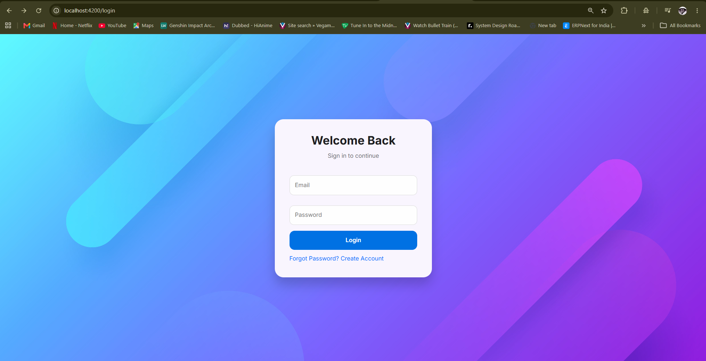
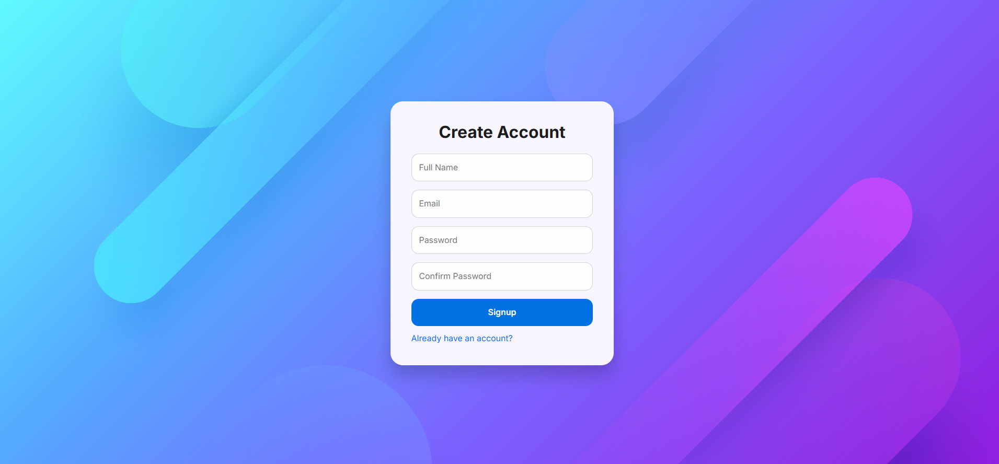
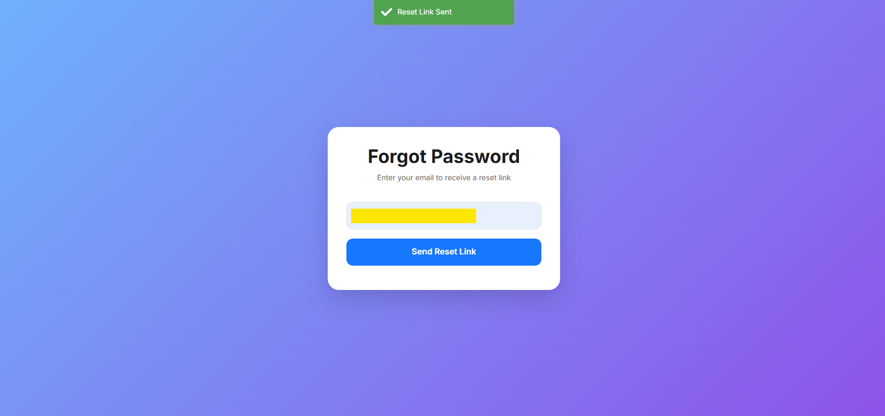
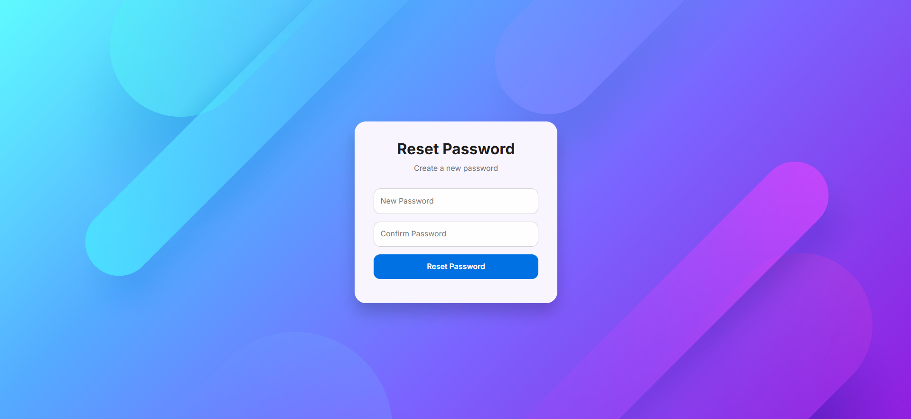
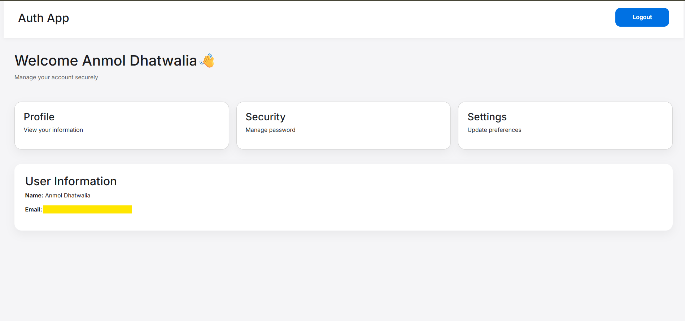

# Full-Stack Authentication System

A robust and secure full-stack authentication system built with **Angular 21** and **Node.js/Express**. This project demonstrates a complete user authentication flow, including signup, login, password recovery, and protected routes.

---

## 📸 Preview

# Project Task

## Login Page



## Signup Page




## Forgot Password Page



## Reset Password Page



## Dashboard Page



---

## 🚀 Features

-   **User Registration**: Secure signup with password hashing (Bcrypt).
-   **User Login**: JWT-based authentication for secure session management.
-   **Forgot Password**: Email-based password recovery using Nodemailer.
-   **Reset Password**: Secure token-based password reset flow.
-   **Protected Routes**: Dashboard accessible only to authenticated users via Auth Guards.
-   **Modern UI**: Responsive design built with Bootstrap 5 and FontAwesome.
-   **Real-time Notifications**: User feedback using `ngx-toastr`.
-   **API Security**: Protected endpoints with JWT verification middleware.

---

## 🛠️ Tech Stack

### Frontend
-   **Framework**: Angular 21
-   **Styling**: Bootstrap 5, Vanilla CSS
-   **Icons**: FontAwesome, Bootstrap Icons
-   **Notifications**: ngx-toastr
-   **Routing**: Angular Router with Lazy Loading

### Backend
-   **Runtime**: Node.js
-   **Framework**: Express.js
-   **Database**: MongoDB (Mongoose ODM)
-   **Authentication**: JSON Web Tokens (JWT)
-   **Email Service**: Nodemailer (Gmail SMTP)
-   **Security**: Bcrypt for password encryption

---

## ⚙️ Installation & Setup

### Prerequisites
-   Node.js (v18+ recommended)
-   MongoDB Atlas account or local MongoDB instance
-   Gmail account (for sending recovery emails)

### 1. Clone the Repository
```bash
git clone https://github.com/your-username/your-repo-name.git
cd your-repo-name
```

### 2. Backend Setup
```bash
cd backend
npm install
```

Create a `.env` file in the `backend` directory:
```env
PORT=5000
MONGO_URI=your_mongodb_connection_string
JWT_SECRET=your_super_secret_key
EMAIL_USER=your-email@gmail.com
EMAIL_PASS=your-app-password
```

### 3. Frontend Setup
```bash
cd ../frontend
npm install
```

### 4. Running the Application

**Start Backend:**
```bash
cd backend
npm start
```

**Start Frontend:**
```bash
cd frontend
npm start
```

Visit `http://localhost:4200` to see the application in action!

---

## 🔄 How It Works

1.  **Signup**: User provides details which are validated and stored in MongoDB. Passwords are encrypted before saving.
2.  **Login**: Upon successful login, the backend generates a **JWT token** which is sent to the frontend.
3.  **Authentication**: The frontend stores the token and includes it in the `Authorization` header for subsequent API requests using an **HTTP Interceptor**.
4.  **Authorization**: The backend verifies the token using middleware before granting access to protected routes.
5.  **Password Recovery**: 
    -   User requests a reset via the "Forgot Password" page.
    -   Backend generates a temporary token and sends a link to the user's email.
    -   User clicks the link, enters a new password, and the backend updates the database.

---

## 📂 Project Structure

```
project/
├── backend/
│   ├── config/          # Database connection
│   ├── controllers/     # Auth logic
│   ├── middleware/      # JWT verification
│   ├── models/          # Mongoose schemas
│   ├── routes/          # API endpoints
│   └── utils/           # Email utility
└── frontend/
    └── src/
        └── app/
            ├── auth/        # Login, Signup, Password components
            ├── dashboard/   # Protected component
            ├── guards/      # Route protection
            ├── interceptors/# Token handling
            └── services/    # API calls
```

---

<!-- ## 📝 License

This project is licensed under the ISC License. -->
